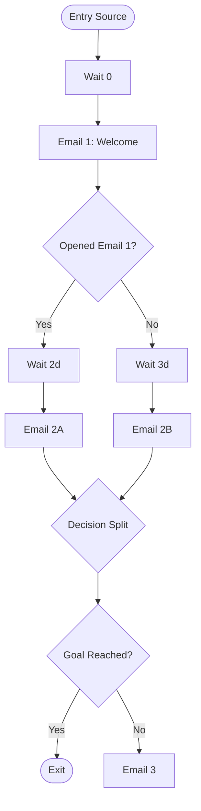

# SFMC - Journey

CLI for SFMC Journey Builder. Helps design, configure, and troubleshoot journeys: entry sources, decision splits, engagement splits, wait steps, email activities, and exit criteria.

## When To Use

Use this skill when the user needs to plan, build, or debug SFMC journeys. Covers journey architecture, entry source configuration, branching logic, wait periods, activity configuration, and goal tracking.

## Trigger Phrases

- "Journey Builder"
- "build a journey"
- "journey entry source"
- "decision split"
- "engagement split"
- "journey troubleshooting"
- "SFMC journey"

## Instructions

### Step 1 — Define the Journey

Clarify:

- Journey goal: onboarding / nurture / re-engagement / transactional / promotional
- Entry source: DE entry / API event / audience / salesforce data
- Re-entry: allowed / not allowed / only after exit
- Duration: how long contacts stay in the journey
- Exit criteria: what removes someone early

### Step 2 — Design the Journey

**Output format:**

```
JOURNEY DESIGN
══════════════

NAME: [descriptive name]
GOAL: [what success looks like — metric + threshold]
ENTRY: [source type + configuration]
RE-ENTRY: [policy]
EXIT CRITERIA: [conditions that remove contacts]
```

**Journey map (Mermaid):**

Always render the journey flow as a Mermaid `flowchart TD` diagram. Generate or regenerate it whenever showing, designing, or explaining a journey flow, and whenever the user asks for a flow, map, or diagram.



Mermaid node conventions:

- `([...])` — entry sources and exits
- `[...]` — activities (email, wait, update contact)
- `{...}` — decision splits and engagement splits (label branches with `-->|Yes|` / `-->|No|` or the split values)

**Journey map (ASCII fallback):**

Include a plain-text ASCII map as well, for terminals or contexts where Mermaid does not render.

```
[Entry] ──→ [Wait 0] ──→ [Email 1: Welcome]
                                 │
                           ┌─────┴─────┐
                      [Opened?]    [No Open]
                           │           │
                     [Wait 2d]    [Wait 3d]
                           │           │
                     [Email 2A]   [Email 2B]
                           │           │
                           └─────┬─────┘
                                 │
                         [Decision Split]
                                 │
                         [Goal Reached?]
                                 │
                           ┌─────┴─────┐
                        [Yes: Exit]  [No: Email 3]
```

**Step details:**

| Step | Type | Configuration | Wait | Notes |
|------|------|--------------|------|-------|
| 1 | Email | [template + DE] | 0 | Welcome email |
| 2 | Engagement Split | Opened Email 1 | 2d/3d | Branch on engagement |
| 3 | Decision Split | [attribute condition] | 0 | Segment by behavior |

**Entry DE schema:**

| Field | Type | Required | Notes |
|-------|------|----------|-------|
| ContactKey | Text(254) | Yes | Matches Contact Key |
| EmailAddress | EmailAddress | Yes | Send target |
| [custom fields] | [type] | [Y/N] | [used in personalization] |

### Step 3 — Troubleshooting

Common issues:

- Contacts not entering — check entry source DE is populated and journey is Active
- Contacts stuck at wait step — verify wait period and timezone settings
- Engagement split not working — allow 24h for tracking data to populate
- Emails not sending — check send classification and sender profile
- Goal not triggering — verify goal criteria matches data structure
- Duplicate sends — check re-entry settings and contact key uniqueness

## Rules

- Always render the journey flow as a Mermaid `flowchart TD` diagram; generate or regenerate it whenever showing a flow or when the user asks for a flow, map, or diagram
- Also include an ASCII journey map as a plain-text fallback for visual clarity
- Specify the entry DE schema — incomplete schemas cause journey failures
- Include exit criteria — journeys without exits accumulate stale contacts
- Engagement splits need 24h wait minimum for tracking data
- Recommend journey naming: `[Type]-[Audience]-[Version]` (e.g., Onboarding-Trial-v2)
